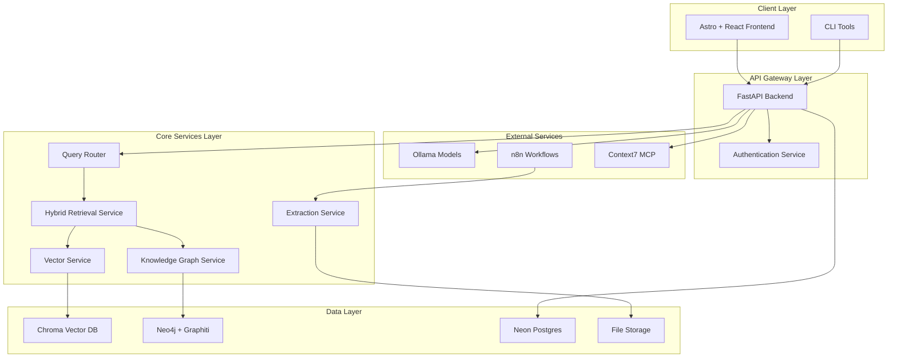

# Design Document

## Overview

The Dixie Chemical Product Agent v3 is designed as a comprehensive agentic RAG application that combines vector database search with knowledge graph reasoning to provide intelligent access to technical chemical product information. The system follows a microservices architecture within a monorepo structure, enabling modular development and deployment while maintaining code sharing and consistency.

The core innovation lies in the hybrid retrieval system that intelligently routes queries between vector search and knowledge graph traversal based on query type and complexity. This approach enables the system to handle diverse query patterns from simple specification lookups to complex relationship exploration and product comparisons.

## Architecture

### High-Level System Architecture



### Monorepo Structure Design

```
dixie-product-agent-v3/
├── apps/
│   ├── backend/                    # FastAPI application
│   │   ├── src/dc_agent/
│   │   │   ├── api/               # FastAPI routes and middleware
│   │   │   ├── services/          # Business logic services
│   │   │   ├── models/            # Pydantic models and schemas
│   │   │   ├── vector/            # Vector database interface
│   │   │   ├── kg/                # Knowledge graph services
│   │   │   ├── retrieval/         # Hybrid retrieval logic
│   │   │   ├── auth/              # Authentication services
│   │   │   └── utils/             # Shared utilities
│   │   ├── tests/                 # Test suite
│   │   ├── pyproject.toml         # UV dependencies
│   │   ├── Dockerfile
│   │   └── .env.example
│   ├── frontend/                   # Astro + React application
│   │   ├── src/
│   │   │   ├── components/        # React components (ShadCN)
│   │   │   ├── pages/             # Astro pages
│   │   │   ├── layouts/           # Page layouts
│   │   │   ├── lib/               # Utility functions
│   │   │   ├── hooks/             # React hooks
│   │   │   └── types/             # TypeScript types
│   │   ├── public/                # Static assets
│   │   ├── package.json           # pnpm dependencies
│   │   ├── astro.config.mjs
│   │   ├── tailwind.config.js
│   │   └── Dockerfile
│   └── pdf-extractor/              # Migrated extraction utility
│       ├── src/dc_extractor/
│       │   ├── extract_validator/
│       │   ├── ingest/
│       │   ├── chunker/
│       │   └── kg_export/
│       ├── tests/
│       ├── pyproject.toml
│       └── README.md
├── packages/
│   ├── shared-types/               # Shared TypeScript types
│   │   ├── src/
│   │   │   ├── api.ts
│   │   │   ├── models.ts
│   │   │   └── index.ts
│   │   └── package.json
│   └── shared-schemas/             # JSON schemas
│       ├── schemas/
│       │   ├── base-extraction.json
│       │   ├── derived-info.json
│       │   └── api-responses.json
│       └── package.json
├── infrastructure/
│   ├── docker/
│   │   ├── docker-compose.yml
│   │   ├── docker-compose.prod.yml
│   │   └── .env.example
│   ├── k8s/                       # Kubernetes manifests (future)
│   └── terraform/                 # Infrastructure as code (future)
├── data/                          # Data directories (gitignored)
├── docs/                          # Documentation
├── scripts/                       # Development and deployment scripts
├── Makefile                       # Development commands
├── turbo.json                     # Turbo repo configuration
└── README.md
```

## Components and Interfaces

### 1. Query Router Service

The Query Router analyzes incoming queries and determines the optimal retrieval strategy.

```python
from enum import Enum
from typing import Dict, Any, List
from pydantic import BaseModel

class QueryType(Enum):
    SPECIFICATION = "specification"     # "What's the viscosity of ASA 150?"
    APPLICATION = "application"         # "What products work for coatings?"
    COMPARISON = "comparison"           # "Compare ASA 150 vs ASA 140"
    RELATIONSHIP = "relationship"       # "What's similar to DCA 467?"
    GENERAL = "general"                # General questions

class QueryAnalysis(BaseModel):
    query_type: QueryType
    entities: List[str]
    intent_confidence: float
    suggested_strategy: Dict[str, Any]

class QueryRouter:
    def analyze_query(self, query: str) -> QueryAnalysis:
        """Analyze query and return routing strategy"""
        pass

    def get_retrieval_weights(self, analysis: QueryAnalysis) -> Dict[str, float]:
        """Return optimal weights for vector vs KG retrieval"""
        pass
```

### 2. Hybrid Retrieval Service

The core service that orchestrates retrieval from multiple sources.

```python
from typing import List, Optional
from dataclasses import dataclass

@dataclass
class RetrievalResult:
    content: str
    score: float
    source: str  # 'vector', 'kg', 'hybrid'
    metadata: Dict[str, Any]
    provenance: Dict[str, Any]

class HybridRetrievalService:
    def __init__(self, vector_service, kg_service, query_router):
        self.vector_service = vector_service
        self.kg_service = kg_service
        self.query_router = query_router

    async def search(self, query: str, k: int = 10) -> List[RetrievalResult]:
        """Perform hybrid search combining vector and KG results"""
        # 1. Analyze query
        analysis = self.query_router.analyze_query(query)

        # 2. Get retrieval weights
        weights = self.query_router.get_retrieval_weights(analysis)

        # 3. Parallel retrieval
        vector_results = await self._vector_search(query, weights['vector'])
        kg_results = await self._kg_search(query, analysis.entities, weights['kg'])

        # 4. Fusion and ranking
        return self._fuse_results(vector_results, kg_results, k)
```

### 3. Vector Database Interface

Abstracted interface for vector operations with Chroma implementation.

```python
from abc import ABC, abstractmethod
from typing import List, Dict, Any, Optional

class VectorStore(ABC):
    @abstractmethod
    async def add_documents(self, documents: List[Dict[str, Any]]) -> None:
        """Add documents to the vector store"""
        pass

    @abstractmethod
    async def similarity_search(self, query: str, k: int = 10) -> List[RetrievalResult]:
        """Perform similarity search"""
        pass

    @abstractmethod
    async def delete_collection(self, collection_name: str) -> None:
        """Delete a collection"""
        pass

class ChromaVectorStore(VectorStore):
    def __init__(self, client_settings: Dict[str, Any]):
        self.client = chromadb.Client(Settings(**client_settings))

    async def add_documents(self, documents: List[Dict[str, Any]]) -> None:
        """Chroma-specific implementation"""
        pass
```

### 4. Knowledge Graph Service

Service for managing entities and relationships using Neo4j + Graphiti.

```python
from graphiti import Graphiti
from neo4j import GraphDatabase

class KnowledgeGraphService:
    def __init__(self, neo4j_uri: str, neo4j_user: str, neo4j_password: str):
        self.driver = GraphDatabase.driver(neo4j_uri, auth=(neo4j_user, neo4j_password))
        self.graphiti = Graphiti(self.driver)

    async def add_entities(self, entities: List[Dict[str, Any]]) -> None:
        """Add entities to the knowledge graph"""
        pass

    async def find_related_entities(self, entity_name: str, max_depth: int = 2) -> List[Dict[str, Any]]:
        """Find entities related to the given entity"""
        pass

    async def query_by_relationship(self, relationship_type: str, limit: int = 10) -> List[Dict[str, Any]]:
        """Query entities by relationship type"""
        pass
```

### 5. FastAPI Application Structure

```python
from fastapi import FastAPI, Depends, HTTPException
from fastapi.middleware.cors import CORSMiddleware
from pydantic import BaseModel

app = FastAPI(title="Dixie Chemical Product Agent API", version="3.0.0")

# Middleware
app.add_middleware(CORSMiddleware, allow_origins=["*"])

# Request/Response Models
class ChatRequest(BaseModel):
    query: str
    conversation_id: Optional[str] = None
    max_results: int = 10

class ChatResponse(BaseModel):
    answer: str
    sources: List[RetrievalResult]
    conversation_id: str
    query_analysis: QueryAnalysis

# Routes
@app.post("/api/chat", response_model=ChatResponse)
async def chat_endpoint(request: ChatRequest):
    """Main chat endpoint for conversational queries"""
    pass

@app.get("/api/products")
async def list_products():
    """List all available products"""
    pass

@app.get("/api/products/{product_id}")
async def get_product(product_id: str):
    """Get detailed product information"""
    pass

@app.get("/api/kg/neighbors/{entity_name}")
async def get_entity_neighbors(entity_name: str):
    """Get knowledge graph neighbors for an entity"""
    pass
```

### 6. Frontend Component Architecture

```typescript
// Core types
interface Product {
  id: string;
  name: string;
  family: string;
  properties: Record<string, any>;
  applications: string[];
}

interface ChatMessage {
  id: string;
  content: string;
  role: "user" | "assistant";
  sources?: RetrievalResult[];
  timestamp: Date;
}

// Main components
export const ChatInterface: React.FC = () => {
  // Chat functionality with ShadCN components
};

export const ProductBrowser: React.FC = () => {
  // Product browsing with search and filters
};

export const KnowledgeGraphViewer: React.FC<{ productId: string }> = () => {
  // Interactive knowledge graph visualization
};
```

## Data Models

### 1. Document Processing Models

```python
from pydantic import BaseModel, Field
from typing import List, Optional, Dict, Any
from datetime import datetime
from uuid import UUID

class DocumentMetadata(BaseModel):
    doc_id: UUID
    filename: str
    source_filepath: str
    processed_at: datetime
    file_hash: str
    page_count: int

class ProductInfo(BaseModel):
    product_name: str
    product_short_name: str
    product_family: str
    cas_number: Optional[str]
    chemical_name: Optional[str]
    synonyms: List[str] = []

class PropertySpecification(BaseModel):
    category: str
    name: str
    value_string: Optional[str]
    value_numeric: Optional[float]
    value_min: Optional[float]
    value_max: Optional[float]
    unit: Optional[str]
    test_method: Optional[str]
    page: Optional[int]

class BaseExtraction(BaseModel):
    document_metadata: DocumentMetadata
    product_info: ProductInfo
    properties_and_specifications: List[PropertySpecification]
    applications: List[str]
    key_benefits: List[str]
    sections: List[Dict[str, Any]]
```

### 2. Knowledge Graph Models

```python
class KGEntity(BaseModel):
    entity_id: str
    canonical_name: str
    entity_type: str  # CHEMICAL, APPLICATION, PROPERTY, etc.
    aliases: List[str] = []
    properties: Dict[str, Any] = {}
    source_text: Optional[str]
    confidence: float = 1.0

class KGTriple(BaseModel):
    subject: KGEntity
    predicate: str  # used_in, has_property, similar_to, etc.
    object: Union[KGEntity, str, float]
    source_text: Optional[str]
    confidence: float = 1.0
    provenance: Dict[str, Any] = {}

class KnowledgeGraph(BaseModel):
    entities: List[KGEntity]
    kg_triples: List[KGTriple]
    metadata: Dict[str, Any] = {}
```

### 3. API Response Models

```python
class SearchResult(BaseModel):
    content: str
    score: float
    source: str
    metadata: Dict[str, Any]
    provenance: Dict[str, Any]

class ChatResponse(BaseModel):
    answer: str
    sources: List[SearchResult]
    conversation_id: str
    query_analysis: Dict[str, Any]
    response_time_ms: int
    kg_enhanced: bool
```

## Error Handling

### 1. Exception Hierarchy

```python
class DCAgentException(Exception):
    """Base exception for DC Agent"""
    pass

class VectorStoreException(DCAgentException):
    """Vector database related errors"""
    pass

class KnowledgeGraphException(DCAgentException):
    """Knowledge graph related errors"""
    pass

class QueryProcessingException(DCAgentException):
    """Query processing errors"""
    pass

class ExtractionException(DCAgentException):
    """PDF extraction and validation errors"""
    pass
```

### 2. Error Response Format

```python
class ErrorResponse(BaseModel):
    error_code: str
    message: str
    details: Optional[Dict[str, Any]] = None
    timestamp: datetime
    request_id: str
```

### 3. Graceful Degradation Strategy

- **Vector DB Unavailable**: Fall back to knowledge graph search only
- **Knowledge Graph Unavailable**: Use vector search with reduced functionality
- **LLM Unavailable**: Return raw search results with basic formatting
- **Partial Service Failure**: Continue with available services and flag limitations

## Testing Strategy

### 1. Unit Testing

```python
# Backend testing structure
tests/
├── unit/
│   ├── test_query_router.py
│   ├── test_vector_service.py
│   ├── test_kg_service.py
│   └── test_retrieval_service.py
├── integration/
│   ├── test_api_endpoints.py
│   ├── test_database_operations.py
│   └── test_end_to_end_flows.py
└── performance/
    ├── test_search_performance.py
    └── test_concurrent_users.py
```

### 2. Frontend Testing

```typescript
// Frontend testing structure
src/
├── components/
│   ├── ChatInterface.test.tsx
│   ├── ProductBrowser.test.tsx
│   └── KnowledgeGraphViewer.test.tsx
├── hooks/
│   ├── useChat.test.ts
│   └── useProducts.test.ts
└── integration/
    ├── chat-flow.test.ts
    └── product-search.test.ts
```

### 3. Test Data Management

- **Synthetic Test Data**: Generated test documents and extractions
- **Golden Dataset**: Curated set of real documents for validation
- **Performance Benchmarks**: Standardized queries for performance testing
- **Edge Cases**: Malformed inputs, empty results, timeout scenarios

## Performance Considerations

### 1. Caching Strategy

```python
from functools import lru_cache
import redis

class CacheService:
    def __init__(self, redis_client):
        self.redis = redis_client

    async def get_cached_search(self, query_hash: str) -> Optional[List[SearchResult]]:
        """Get cached search results"""
        pass

    async def cache_search_results(self, query_hash: str, results: List[SearchResult], ttl: int = 3600):
        """Cache search results with TTL"""
        pass
```

### 2. Database Optimization

- **Vector DB**: Optimize embedding dimensions and indexing parameters
- **Neo4j**: Create appropriate indexes on frequently queried properties
- **Connection Pooling**: Implement connection pools for all database connections
- **Query Optimization**: Monitor and optimize slow queries

### 3. Async Processing

```python
import asyncio
from concurrent.futures import ThreadPoolExecutor

class AsyncProcessingService:
    def __init__(self, max_workers: int = 4):
        self.executor = ThreadPoolExecutor(max_workers=max_workers)

    async def parallel_search(self, queries: List[str]) -> List[List[SearchResult]]:
        """Process multiple searches in parallel"""
        tasks = [self.search_single(query) for query in queries]
        return await asyncio.gather(*tasks)
```

## Security Implementation

### 1. Authentication and Authorization

```python
from fastapi import Depends, HTTPException, status
from fastapi.security import HTTPBearer, HTTPAuthorizationCredentials
import jwt

security = HTTPBearer()

async def verify_token(credentials: HTTPAuthorizationCredentials = Depends(security)):
    """Verify JWT token"""
    try:
        payload = jwt.decode(credentials.credentials, SECRET_KEY, algorithms=["HS256"])
        return payload
    except jwt.PyJWTError:
        raise HTTPException(status_code=status.HTTP_401_UNAUTHORIZED)

@app.get("/api/protected-endpoint")
async def protected_endpoint(user = Depends(verify_token)):
    """Protected endpoint example"""
    pass
```

### 2. Input Validation and Sanitization

```python
from pydantic import BaseModel, validator
import re

class QueryRequest(BaseModel):
    query: str

    @validator('query')
    def validate_query(cls, v):
        if len(v.strip()) == 0:
            raise ValueError('Query cannot be empty')
        if len(v) > 1000:
            raise ValueError('Query too long')
        # Remove potentially harmful characters
        return re.sub(r'[<>"\']', '', v.strip())
```

### 3. Rate Limiting

```python
from slowapi import Limiter, _rate_limit_exceeded_handler
from slowapi.util import get_remote_address
from slowapi.errors import RateLimitExceeded

limiter = Limiter(key_func=get_remote_address)
app.state.limiter = limiter
app.add_exception_handler(RateLimitExceeded, _rate_limit_exceeded_handler)

@app.post("/api/chat")
@limiter.limit("10/minute")
async def chat_endpoint(request: Request, chat_request: ChatRequest):
    """Rate-limited chat endpoint"""
    pass
```

This comprehensive design provides a solid foundation for implementing the agentic RAG application with proper separation of concerns, scalability considerations, and robust error handling. The modular architecture enables incremental development and testing while maintaining system reliability and performance.
