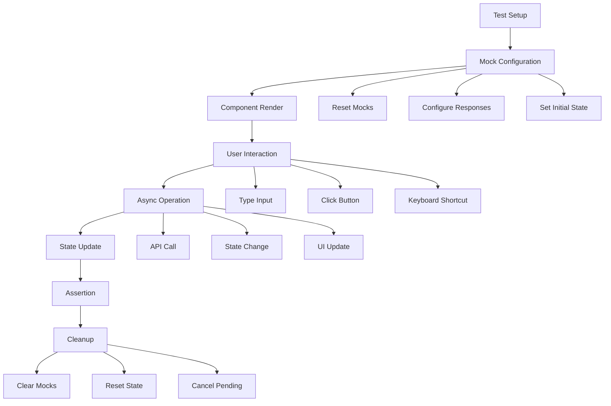

# Integration Test Fixes Design

## Overview

This design addresses the systematic fixing of integration test failures in the chat flow tests. The main issues identified are: improper hook mocking, input handling problems, loading state blocking, and incomplete end-to-end flows. The solution involves fixing the test infrastructure, improving mock configurations, and ensuring proper component integration.

## Architecture

### Test Infrastructure Layer

- **Mock Management**: Centralized mock configuration and reset mechanisms
- **Test Utilities**: Enhanced helper functions for creating test data and scenarios
- **Setup/Teardown**: Proper test lifecycle management with cleanup

### Component Integration Layer

- **Hook Integration**: Proper mocking of useChat and useConversations hooks
- **API Client Mocking**: Consistent API response mocking with proper timing
- **State Management**: Proper state synchronization between hooks and components

### Test Execution Layer

- **Async Handling**: Proper waiting for async operations to complete
- **Event Simulation**: Accurate user interaction simulation
- **Assertion Timing**: Proper timing for assertions with waitFor patterns

## Components and Interfaces

### Enhanced Test Utilities

```typescript
interface TestSetupOptions {
  mockConversations?: Conversation[];
  mockApiResponses?: Partial<ApiClientMocks>;
  initialMessages?: ChatMessage[];
  conversationId?: string;
}

interface MockApiClientEnhanced {
  // Existing methods with enhanced timing control
  sendMessage: MockFunction & { resolveAfter?: number };
  listConversations: MockFunction & { resolveAfter?: number };
  createConversation: MockFunction & { resolveAfter?: number };
  
  // New helper methods
  simulateNetworkDelay: (ms: number) => void;
  simulateError: (error: ApiError) => void;
  resetToDefaults: () => void;
}
```

### Hook Mocking Strategy

```typescript
// Direct hook mocking instead of API client mocking
vi.mock('@/hooks/useChat', () => ({
  useChat: vi.fn(() => mockUseChatReturn)
}));

vi.mock('@/hooks/useConversations', () => ({
  useConversations: vi.fn(() => mockUseConversationsReturn)
}));
```

### Component Test Wrapper

```typescript
interface TestWrapperProps {
  children: React.ReactNode;
  initialState?: {
    conversations?: Conversation[];
    messages?: ChatMessage[];
    conversationId?: string;
  };
}

const TestWrapper: React.FC<TestWrapperProps> = ({ children, initialState }) => {
  // Provides consistent test environment
  return (
    <TestProvider initialState={initialState}>
      {children}
    </TestProvider>
  );
};
```

## Data Models

### Mock Response Timing

```typescript
interface MockResponseConfig {
  delay?: number;
  shouldFail?: boolean;
  errorType?: 'network' | 'server' | 'timeout';
  retryable?: boolean;
}

interface TestScenario {
  name: string;
  setup: TestSetupOptions;
  actions: TestAction[];
  expectations: TestExpectation[];
}
```

### Test Action Types

```typescript
type TestAction = 
  | { type: 'type'; text: string; element: string }
  | { type: 'click'; element: string }
  | { type: 'wait'; condition: string; timeout?: number }
  | { type: 'keyboard'; keys: string };

type TestExpectation =
  | { type: 'element'; selector: string; state: 'visible' | 'hidden' | 'disabled' | 'enabled' }
  | { type: 'text'; content: string; present: boolean }
  | { type: 'api'; method: string; called: boolean; args?: any[] };
```

## Error Handling

### Mock Error Scenarios

1. **Network Errors**: Simulate connection failures with proper error types
2. **Server Errors**: Mock 500-level responses with retry logic
3. **Timeout Errors**: Simulate slow responses that exceed timeout limits
4. **Validation Errors**: Mock 400-level responses for invalid input

### Error Recovery Testing

```typescript
interface ErrorRecoveryTest {
  initialError: ApiError;
  recoveryAction: 'retry' | 'new-conversation' | 'clear-error';
  expectedOutcome: 'success' | 'persistent-error' | 'fallback-state';
}
```

## Testing Strategy

### Test Categories

1. **Unit Integration Tests**: Individual component behavior with mocked dependencies
2. **Flow Integration Tests**: Multi-step user workflows with realistic timing
3. **Error Scenario Tests**: Error handling and recovery mechanisms
4. **Performance Tests**: Loading states and response timing

### Mock Strategy Improvements

#### Current Issues

- API client mocks are not properly isolated between tests
- Loading states persist indefinitely due to unresolved promises
- Input events are not properly simulated
- Async operations don't complete before assertions

#### Proposed Solutions

1. **Direct Hook Mocking**: Mock hooks directly instead of API client
2. **Controlled Async Resolution**: Use manual promise resolution for timing control
3. **Enhanced Event Simulation**: Use proper user-event library patterns
4. **Proper Cleanup**: Ensure all async operations complete or are cancelled

### Test Execution Flow



## Implementation Approach

### Phase 1: Test Infrastructure

1. Fix mock configuration and reset mechanisms
2. Enhance test utilities with better mock control
3. Implement proper cleanup procedures

### Phase 2: Hook Integration

1. Switch from API client mocking to direct hook mocking
2. Implement controlled async resolution
3. Fix loading state management

### Phase 3: Component Fixes

1. Fix input handling and event simulation
2. Improve async operation waiting
3. Fix assertion timing and conditions

### Phase 4: Flow Testing

1. Implement end-to-end conversation flows
2. Test error handling and recovery
3. Verify markdown rendering and source interaction

### Phase 5: Validation

1. Run complete test suite
2. Verify all tests pass consistently
3. Optimize test performance and reliability

## Key Design Decisions

1. **Direct Hook Mocking**: Mock hooks directly rather than API client to avoid timing issues
2. **Manual Promise Control**: Use controlled promise resolution for predictable async behavior
3. **Enhanced Test Utilities**: Create comprehensive mock factories and setup helpers
4. **Proper Cleanup**: Implement thorough cleanup to prevent test interference
5. **Realistic Timing**: Add appropriate delays to simulate real user interactions
