# Visual Diagrams: useConversations Test Failures

## Problem Flow Diagram

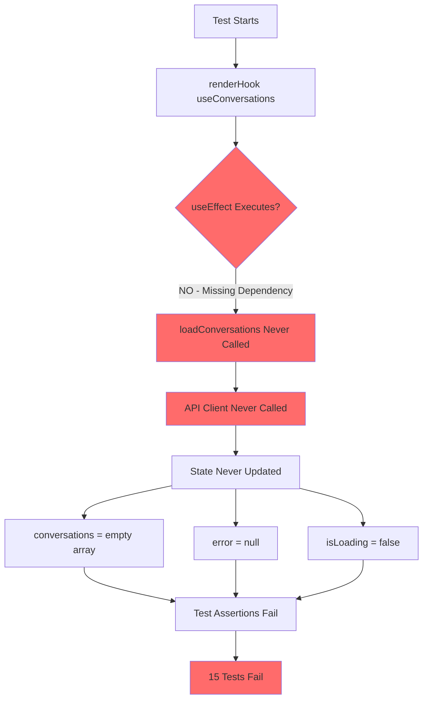

## Solution Flow Diagram

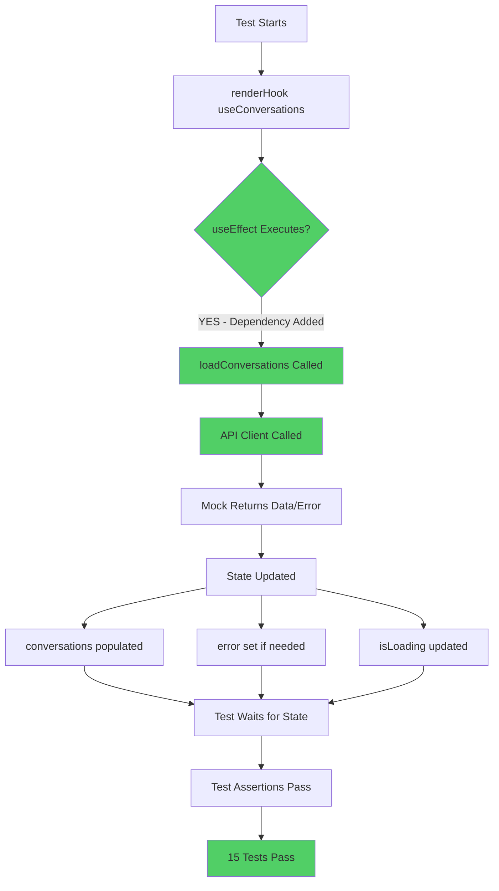

## Test Failure Cascade

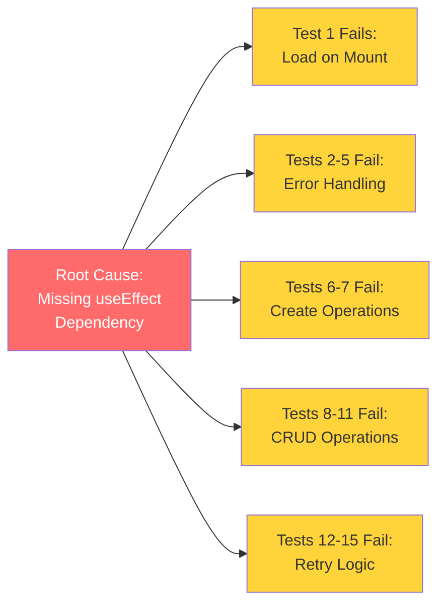

## Fix Implementation Sequence

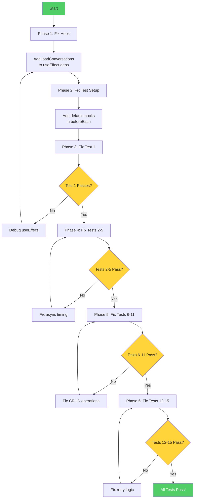

## Hook Lifecycle - Current (Broken)

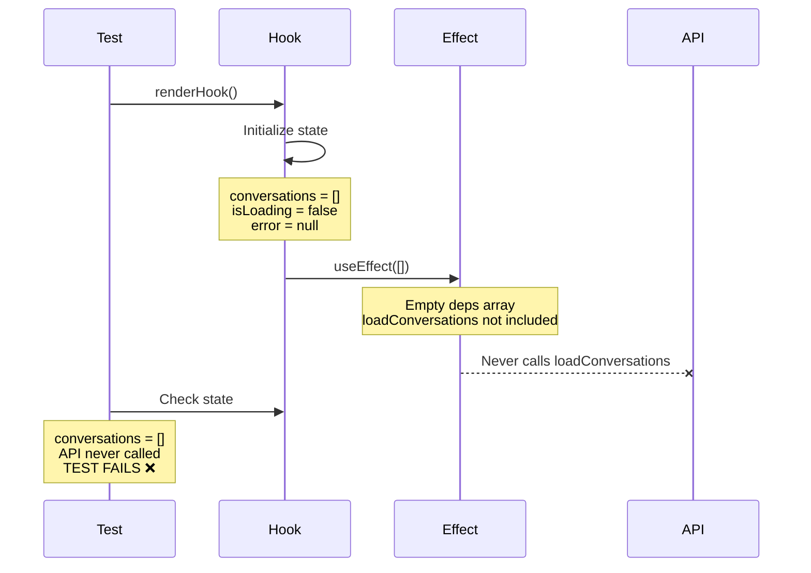

## Hook Lifecycle - Fixed

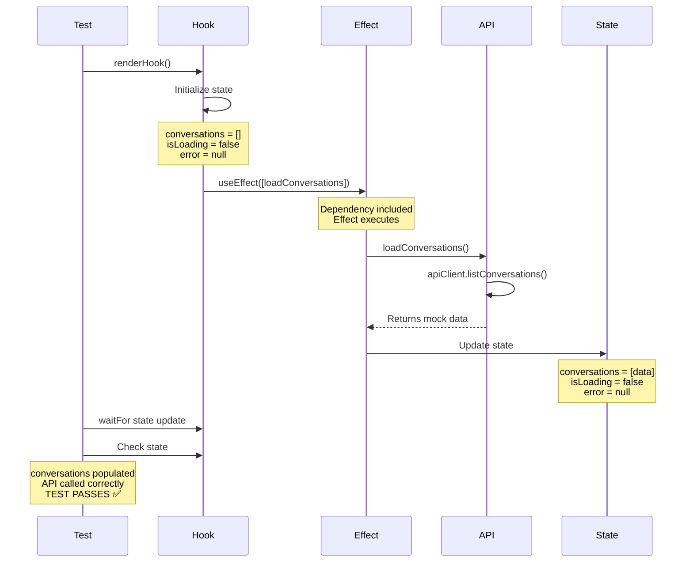

## Test Timing Issues

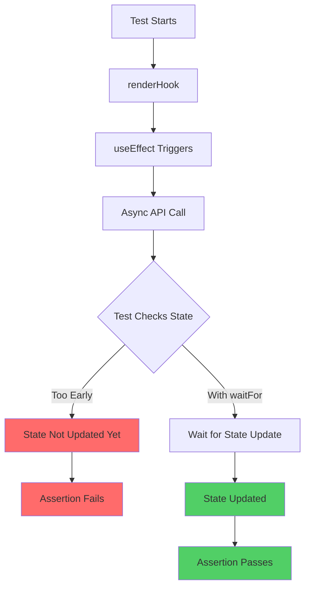

## Error Handling Flow - Current (Broken)

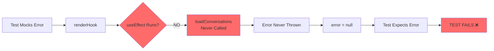

## Error Handling Flow - Fixed

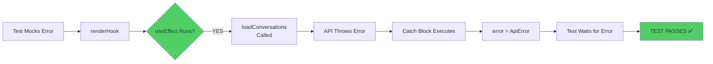

## CRUD Operations Flow - Current (Broken)

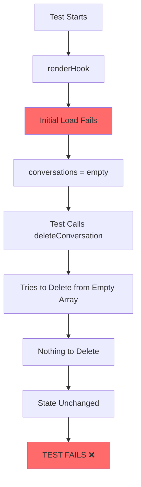

## CRUD Operations Flow - Fixed

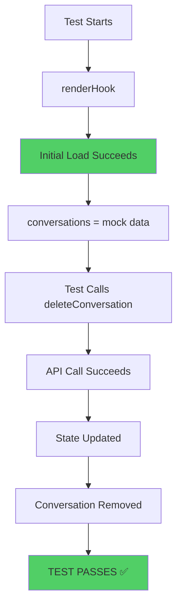

## Key Insights

### 1. The Domino Effect

```
Missing Dependency → No Effect Execution → No API Calls → No State Updates → All Tests Fail
```

### 2. The Fix Hierarchy

```
Level 1: Fix Hook (useEffect dependency)
    ↓
Level 2: Fix Test Setup (default mocks)
    ↓
Level 3: Fix Test Timing (waitFor patterns)
    ↓
Level 4: Fix Specific Tests (edge cases)
```

### 3. Test Categories by Dependency

```
Category A (Depends on Initial Load):
  - Tests 1, 8, 9, 10, 11, 12, 13, 14, 15

Category B (Depends on Error Handling):
  - Tests 2, 3, 4, 5

Category C (Depends on Operations):
  - Tests 6, 7
```

## Before and After Comparison

### Before (Broken)

```typescript
useEffect(() => {
  loadConversations();
}, []); // ❌ Missing dependency
```

**Result**: Effect never runs → Tests fail

### After (Fixed)

```typescript
useEffect(() => {
  loadConversations();
}, [loadConversations]); // ✅ Dependency included
```

**Result**: Effect runs → Tests pass

## Testing Pattern Evolution

### Old Pattern (Unreliable)

```typescript
const { result } = renderHook(() => useConversations());
expect(result.current.conversations).toEqual(mockData); // ❌ Fails immediately
```

### New Pattern (Reliable)

```typescript
const { result } = renderHook(() => useConversations());
await waitFor(() => {
  expect(result.current.isLoading).toBe(false); // ✅ Wait for async
});
expect(result.current.conversations).toEqual(mockData); // ✅ Now passes
```

## Summary

The entire test failure cascade stems from a single missing dependency in the `useEffect` hook. Once fixed, all tests should pass with proper async handling patterns.
