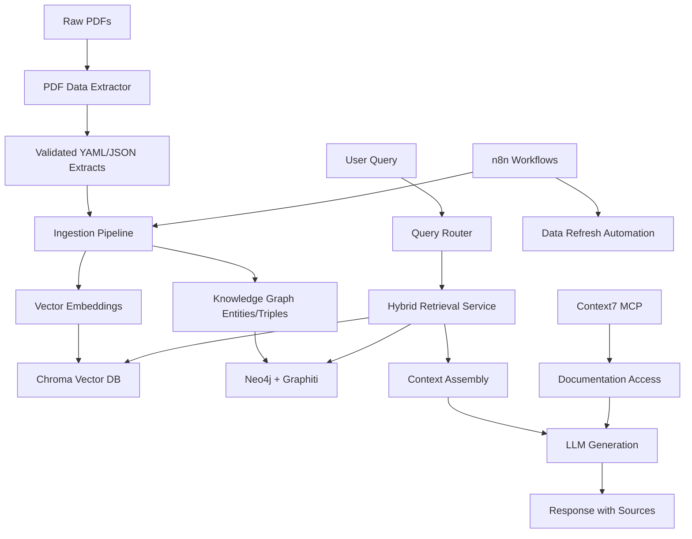

# Dixie Chemical Product Agent v3 - Agentic RAG Application

## Project Overview

This is version 3 of an agentic RAG (Retrieval-Augmented Generation) application that provides intelligent search and question-answering capabilities over a comprehensive library of technical chemical product documents (Technical Bulletins). The system combines vector database search with knowledge graph reasoning to deliver precise, contextual answers about chemical products, their properties, applications, and relationships.

## Architecture Overview

### Core Components

1. **PDF Data Extractor Utility** - Dedicated extraction and validation pipeline
2. **Vector Database Layer** - Chroma-based semantic search with swappable backends
3. **Knowledge Graph Layer** - Neo4j + Graphiti for entity relationships
4. **Backend API** - Python FastAPI with comprehensive business logic
5. **Frontend UI** - Astro + React chat interface and product browser
6. **Automation Layer** - n8n workflows for data processing and updates
7. **Model Context Protocol** - Context7 integration for documentation access

### Technology Stack

#### Backend (Python)
- **Package Management**: Astral UV with pyproject.toml (NO pip install)
- **Framework**: FastAPI with async/await patterns
- **Vector DB**: Chroma (with swappable interface for future alternatives)
- **Knowledge Graph**: Neo4j + Graphiti for entity management
- **Database**: Neon Postgres (if needed for metadata/user data)
- **Automation**: n8n for workflow orchestration
- **Testing**: pytest with comprehensive unit tests
- **Code Quality**: ruff, black, mypy for linting and type checking

#### Frontend (TypeScript)
- **Framework**: Astro + React (NO JavaScript, TypeScript only)
- **Styling**: Tailwind CSS 4
- **Package Management**: pnpm (NO npm)
- **Build System**: Turbo Repo for monorepo management
- **Testing**: Vitest for unit tests

#### Infrastructure
- **Containerization**: Docker with docker-compose for local development
- **Local AI**: Ollama (external to Docker on macOS for GPU access)
- **Deployment**: Docker-ready for cloud hosting services
- **CI/CD**: GitHub Actions with quality gates

## Data Flow Architecture



## Project Structure

```
dixie-product-agent-v3/
├── apps/
│   ├── backend/                    # FastAPI backend
│   │   ├── src/
│   │   │   ├── dc_agent/
│   │   │   │   ├── api/           # FastAPI routes
│   │   │   │   ├── services/      # Business logic
│   │   │   │   ├── models/        # Data models
│   │   │   │   ├── vector/        # Vector DB interface
│   │   │   │   ├── kg/            # Knowledge graph services
│   │   │   │   ├── retrieval/     # Hybrid retrieval logic
│   │   │   │   └── utils/         # Utilities
│   │   │   └── tests/             # Comprehensive test suite
│   │   ├── pyproject.toml         # UV package management
│   │   └── Dockerfile
│   ├── frontend/                   # Astro + React frontend
│   │   ├── src/
│   │   │   ├── components/        # React components
│   │   │   ├── pages/             # Astro pages
│   │   │   ├── layouts/           # Page layouts
│   │   │   └── types/             # TypeScript types
│   │   ├── package.json           # pnpm dependencies
│   │   └── Dockerfile
│   └── pdf-extractor/              # Existing extraction utility
│       ├── backend/
│       │   ├── extract_validator/
│       │   ├── ingest/
│       │   └── tests/
│       └── pyproject.toml
├── packages/
│   ├── shared-types/               # Shared TypeScript types
│   └── shared-schemas/             # JSON schemas
├── data/                           # Data directories
│   ├── raw_pdfs/                  # Source PDF files
│   ├── extracts/                  # Processed extractions
│   ├── embeddings/                # Vector embeddings
│   └── kg/                        # Knowledge graph exports
├── docs/                          # Documentation
├── reference/                     # Reference data and schemas
├── docker-compose.yml             # Local development stack
├── turbo.json                     # Turbo repo configuration
├── Makefile                       # Development commands
└── README.md
```

## Development Workflow

### Local Development Setup

1. **Prerequisites**
   - Docker Desktop with sufficient resources
   - Ollama installed and running locally (not in Docker)
   - UV installed for Python package management
   - pnpm installed for Node.js package management

2. **Initial Setup**
   ```bash
   # Clone and setup
   git clone <repository>
   cd dixie-product-agent-v3
   
   # Install dependencies
   make install
   
   # Start infrastructure
   docker-compose up -d
   
   # Run initial data ingestion
   make ingest-data
   
   # Start development servers
   make dev
   ```

3. **Development Commands**
   ```bash
   # Backend development
   make backend-dev          # Start FastAPI with hot reload
   make backend-test         # Run backend tests
   make backend-lint         # Run linting and formatting
   
   # Frontend development  
   make frontend-dev         # Start Astro dev server
   make frontend-test        # Run frontend tests
   make frontend-build       # Build for production
   
   # Data operations
   make extract-pdfs         # Run PDF extraction
   make ingest-data          # Ingest into vector DB and KG
   make validate-data        # Validate extractions
   
   # Full stack
   make dev                  # Start all services
   make test                 # Run all tests
   make lint                 # Run all linting
   make build                # Build all components
   ```

### Testing Strategy

#### Backend Testing (Python)
- **Unit Tests**: Individual service and utility functions
- **Integration Tests**: API endpoints with test database
- **Vector DB Tests**: Embedding and retrieval functionality
- **Knowledge Graph Tests**: Entity and relationship operations
- **Schema Validation Tests**: JSON schema compliance

#### Frontend Testing (TypeScript)
- **Component Tests**: React component behavior
- **Integration Tests**: User interaction flows
- **API Tests**: Backend communication
- **Type Tests**: TypeScript type safety

### Code Quality Standards

#### Python Standards
- **Type Hints**: Full type annotation coverage
- **Linting**: ruff for fast linting
- **Formatting**: black for consistent code style
- **Import Sorting**: isort for organized imports
- **Type Checking**: mypy for static type analysis

#### TypeScript Standards
- **Strict Mode**: TypeScript strict mode enabled
- **ESLint**: Comprehensive linting rules
- **Prettier**: Consistent code formatting
- **Type Safety**: No `any` types allowed

## Key Features

### 1. Hybrid Retrieval System
- **Vector Search**: Semantic similarity using embeddings
- **Knowledge Graph Search**: Entity and relationship traversal
- **Query Routing**: Intelligent routing based on query type
- **Result Fusion**: Combining and ranking results from multiple sources

### 2. Knowledge Graph Capabilities
- **Entity Recognition**: Chemical products, properties, applications
- **Relationship Mapping**: Product similarities, application overlaps
- **Graph Traversal**: Multi-hop reasoning for complex queries
- **Provenance Tracking**: Source attribution for all information

### 3. Chat Interface
- **Natural Language Queries**: Conversational interaction
- **Source Attribution**: Clear citation of information sources
- **Context Awareness**: Multi-turn conversation support
- **Query Suggestions**: Intelligent follow-up recommendations

### 4. Product Browser
- **Searchable Catalog**: Browse all available products
- **Detailed Views**: Comprehensive product information
- **Comparison Tools**: Side-by-side product comparisons
- **Relationship Visualization**: Interactive knowledge graph views

### 5. Automation Workflows
- **Data Refresh**: Automated ingestion of new extractions
- **Quality Monitoring**: Continuous validation of data quality
- **Performance Tracking**: Query performance and accuracy metrics
- **Alert Systems**: Notifications for data issues or updates

## Deployment Architecture

### Local Development
- Docker Compose orchestration
- External Ollama for model inference
- Hot reload for rapid development
- Integrated testing environment

### Production Deployment
- Container-based deployment
- Scalable vector database
- High-availability knowledge graph
- Load-balanced API services
- CDN-delivered frontend

## Security Considerations

### Data Security
- Secure handling of proprietary technical documents
- Access control for sensitive product information
- Audit logging for data access and modifications

### API Security
- Authentication and authorization
- Rate limiting and request validation
- Input sanitization and validation
- CORS configuration for frontend access

### Infrastructure Security
- Container security best practices
- Network segmentation
- Secrets management
- Regular security updates

## Performance Requirements

### Response Times
- **Simple Queries**: < 500ms
- **Complex Queries**: < 2s
- **Knowledge Graph Traversal**: < 1s
- **Vector Search**: < 300ms

### Scalability
- **Concurrent Users**: 100+ simultaneous users
- **Document Volume**: 1000+ technical bulletins
- **Query Volume**: 10,000+ queries per day
- **Data Growth**: 50% annual increase support

## Monitoring and Observability

### Application Metrics
- Query response times and success rates
- Vector search performance and accuracy
- Knowledge graph query efficiency
- User interaction patterns

### Infrastructure Metrics
- Container resource utilization
- Database performance metrics
- API endpoint health and latency
- Error rates and exception tracking

### Business Metrics
- User engagement and satisfaction
- Query success and relevance scores
- Feature adoption and usage patterns
- Data quality and completeness metrics

## Future Enhancements

### Phase 2 Features
- Multi-modal document processing (images, tables)
- Advanced query understanding with NER
- Personalized recommendations
- Collaborative filtering for similar users

### Phase 3 Features
- Real-time document updates
- Advanced analytics and reporting
- Integration with external chemical databases
- Mobile application development

This comprehensive architecture provides a solid foundation for building a production-ready agentic RAG application that can scale with growing data volumes and user demands while maintaining high performance and accuracy standards.